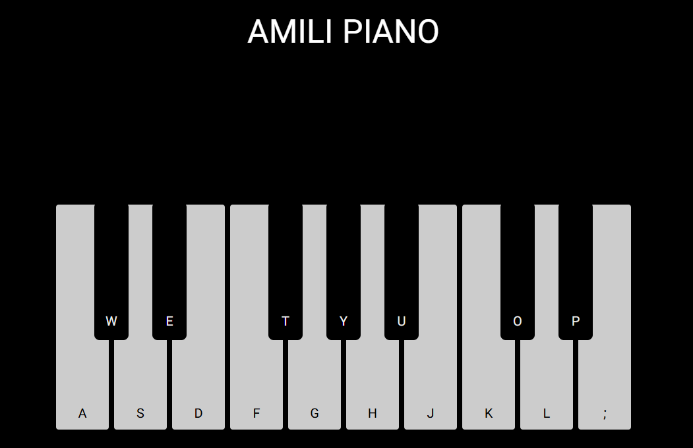

# Basic JavaScript projects 
Basic JavaScript projects that really bring back memories—simple and enjoyable challenges that give a great feeling to anyone starting out.
A JavaScript exercise for beginner front-end developers:
A simple piano made with JavaScript. 
 

# preview

